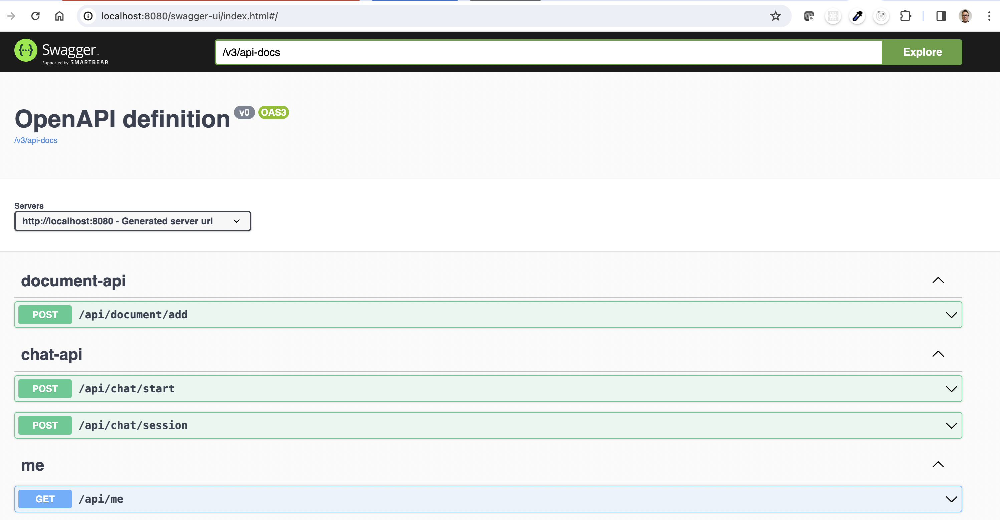
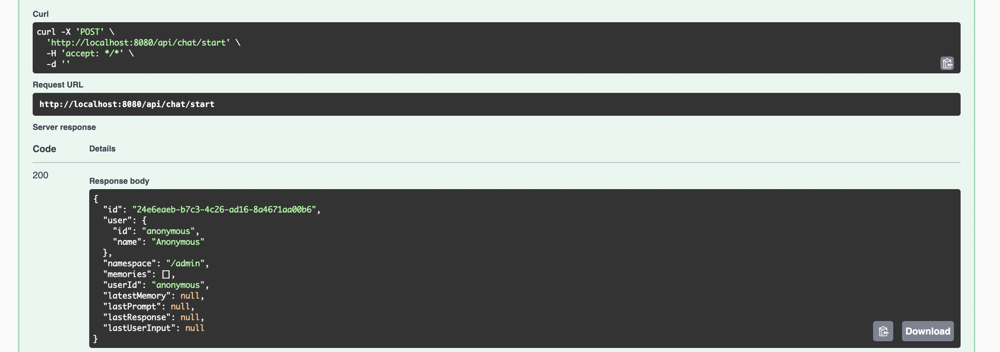
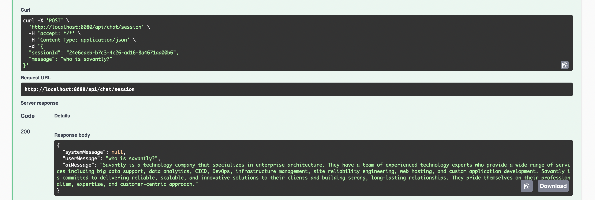

# mainbot


Multi-tenant headless RAG chat bot.  

This is a simple implementation of a multi-tenant chat bot that uses the [Retrieval Augmented Generation](https://arxiv.org/abs/2005.11401).  

Some of this code came from [Wanderling](https://wanderling.io), but all the game specific functions and rules-engine has been trimmed out (not ready to open source that one yet)   

## Quick start

Copy the `example.env` file to `.env`  
Update the values for openai and pinecone.  

```
make dev
```

open [http://localhost:8080/swagger-ui/index.html](http://localhost:4180/swagger-ui/index.html)


## Overview

### Features

- Namespaced vector storage for multi-tenant preparation
- OAuth authentication via JWT header
- User session isolation
- User session history and continuation
- Adding documents to vector storage with a simple embedding pipeline
- Retrieval Augmented Generation as default chat experience


#### Authentication Options 
- Anonymous
- JWT
- OAuth2

#### Conversation Storage Options
- H2
- Postgres

#### Vector storage Options 
- Pinecone
- OpenSearch
- In Memory

#### Embedding pipeline Options
- OpenAI
- OpenSearch 
- Replicate  


## Swagger





### Starting a session 

  


### Sending a message




## Example Configurations  
Spring Profiles are used to configure the application.  
See some example configurations (./src/main/resources/)[./src/main/resources/]

The configuration can be set in YAML, Properties, or Environment variables.  

### OpenAI for Embedding and Pinecone for Vector Storage

```bash
OPENAI_ENABLED=true
OPENAI_KEY=sk-xxxxxxxxxxxxxxxxxxxxxxxx
OPENAI_CHAT_MODEL_ID=gpt-3.5-turbo
PINECONE_ENABLED=true
PINECONE_API_KEY=xxxxxxxxxxxxxxxxxxxxxxxxxxxxxxxx
PINECONE_PROJECT_NAME=my-project
PINECONE_INDEX=my-index
PINECONE_ENVIRONMENT=us-east4-gcp
APP_SECURITY_ENABLED=false
```

### OpenAI for Embedding and OpenSearch for Vector Storage

See the application configuration in [application-opensearch.yml](./src/main/resources/application-opensearch.yml) for more details.  

```bash
SPRING_PROFILES_ACTIVE=opensearch
OPENAI_ENABLED=true
OPENAI_KEY=sk-xxxxxxxxxxxxxxxxxxxxxxxx
OPENAI_CHAT_MODEL_ID=gpt-3.5-turbo
OPENSEARCH_ENABLED=true
OPENSEARCH_URL=https://localhost:9200
```